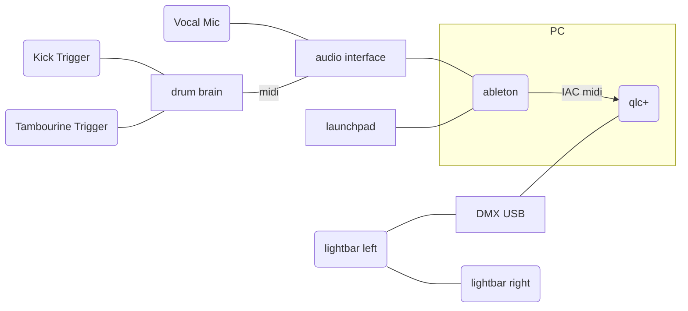

# futuretrash
assets for futuretrash

# Setup

Navation Launchpad as midi controller. Using [Launchpad MK2](https://downloads.novationmusic.com/novation/launchpad-mk2/launchpad-mk2)
Audio Interface for vocals and midi input. Currently using [M-Audio Fasttrack Pro USB](https://www.lclark.edu/live/files/14551-maudio-fast-track-pro-manual).
Drum Brain used for triggers

# Software Setup

Lighting control over DMX requires lighting controller software. A free version that appears to work well is qlc+.
[Install qlc+](https://www.qlcplus.org/). Version 4.12.5

For communicating between Ableton and qlc+ - a virtual midi bus is needed
[Install IAC Driver](https://help.ableton.com/hc/en-us/articles/209774225-Setting-up-a-virtual-MIDI-bus)

