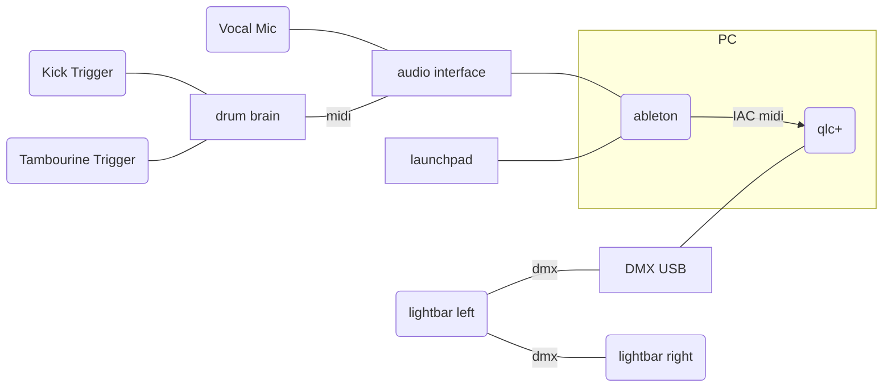

# Show Setup

## Hardware

The following list represents the current state of hardware used for a show.

* Navation Launchpad as midi controller. Using [Launchpad MK2](https://downloads.novationmusic.com/novation/launchpad-mk2/launchpad-mk2)
* Audio Interface for vocals and midi input. Using [M-Audio Fasttrack Pro USB](https://www.lclark.edu/live/files/14551-maudio-fast-track-pro-manual).
* Drum Brain used as triggers for light control. Using [Yamaha DTXpress III](https://usa.yamaha.com/files/download/other_assets/3/324903/DTXPRESSIIIE2.PDF)
* Drum Triggers built from piezo mics. Using [TIMESETL 15pcs Piezo Pickup 27mm Piezo Amplifiers Discs with 13" Leads](https://www.amazon.com/dp/B077YJ3H6R)
* DMX Controller for controller DMX lights. Using [ENTTEC DMX USB PRO](https://www.enttec.com/product/lighting-communication-protocols/dmx512/dmx-usb-pro/)

## Software
Lighting control over DMX requires lighting controller software. A free version that appears to work well is qlc+.
[Install qlc+](https://www.qlcplus.org/). Version 4.12.5

A virtual midi bus is created for communicating between Ableton and qlc+
[Install IAC Driver](https://help.ableton.com/hc/en-us/articles/209774225-Setting-up-a-virtual-MIDI-bus)

Ableton Live to receive audio and midi, process and send midi to lighting controller.
[Ableton Live](https://www.ableton.com/en/live/)

All of the above software appears to be supported by Windows and OSX.

## Connections

