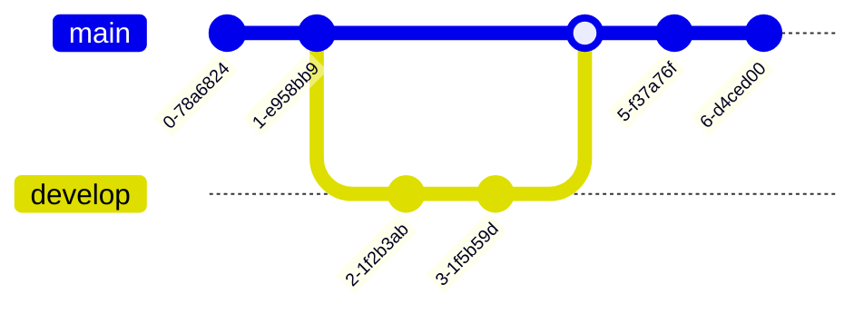

# futuretrash
assets for futuretrash

# Hardware Setup

Navation Launchpad as MIDI controller for vocal effects, lights and 

# Software Setup

Lighting control over DMX requires lighting controller software. A free version that appears to work well is qlc+.
[Install qlc+](https://www.qlcplus.org/). Version 4.12.5

For communicating between Ableton and qlc+ - a virtual midi bus is needed
[Install IAC Driver](https://help.ableton.com/hc/en-us/articles/209774225-Setting-up-a-virtual-MIDI-bus)

